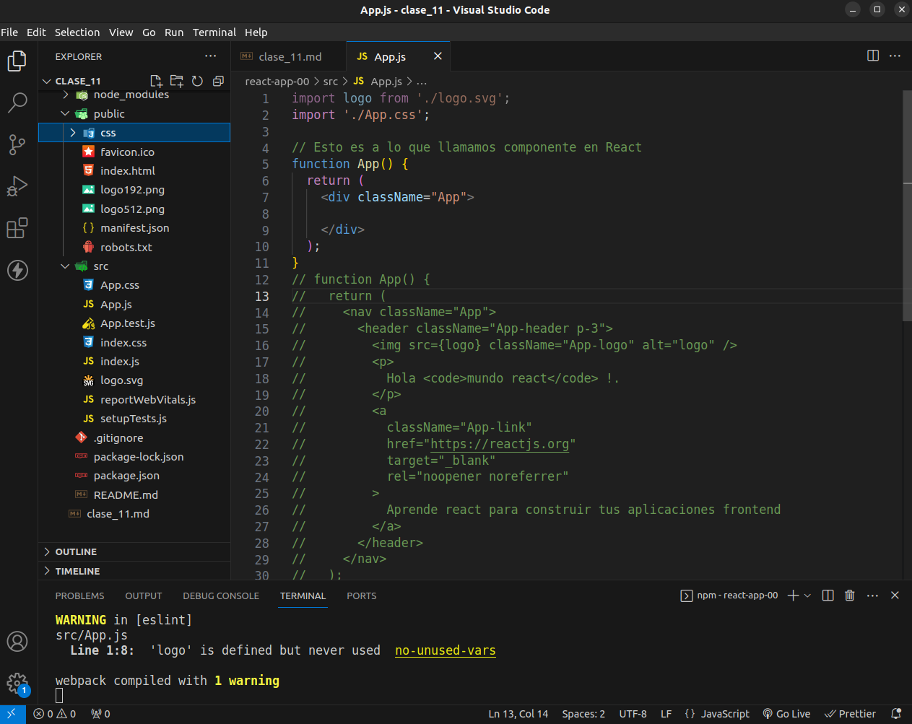
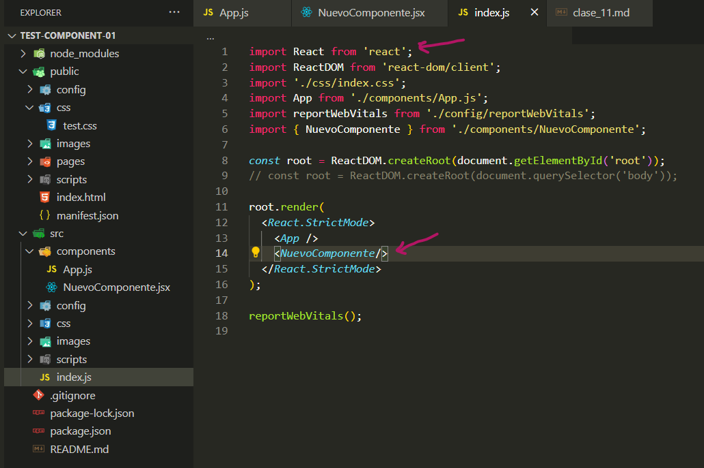

# [Creacion de componentes en React](https://youtu.be/q6CioO7NMkQ?list=PLTiQ_YHUSSeDX7yusyZTG65HcC0NU1W3h&t=263)

- Componentes
- tipos de componentes
- Props

Asegurate de conocer mas a fondo la conexion actual que existe dentro de esta arquitectura, como se comunica y crea los nodos html desde index.js o como aplica los estilos.

### Create [components directory](https://youtu.be/q6CioO7NMkQ?list=PLTiQ_YHUSSeDX7yusyZTG65HcC0NU1W3h&t=466)



La extension para crear nuestro documento para el componente podra ser `jsx` o `js` ambas opciones funcionaran de la misma manera, nosotros iremos en principio probando las 2 formas y dependiendo de como lo estudiemos nos inclinaremos en uno u otra, aunque es posible trabajar con las 2.

Independientemente de la estructura que utilices para crear un componente lo que debemos tener en cuenta es que todas las estructuras tendran un `return` y la exportacion de un unico componente, la logica que tendra el componente que sera igual en cualquiera de las estructuras que utilicemos.

No es posible exportar 2 componentes dentro de un mismo componenete por lo que cada componente que necesitemos lo estaremos creando en su correspondiente `componente.jsx`

## [Creando el directorio components](https://youtu.be/q6CioO7NMkQ?list=PLTiQ_YHUSSeDX7yusyZTG65HcC0NU1W3h&t=1141)

Al nombrar estos componentes, por convencion se lo hace con `UpperCamelCase`

Debemos tener en cuenta que existe una extension para VSC [**ES7+ React/Redux/React-Native snippets**](https://marketplace.visualstudio.com/items?itemName=dsznajder.es7-react-js-snippets) que nos permitira agregar estructuras de componentes en `documentos.jsx` y no tendremos esa opcion si lo hacemos en `documentos.js`

### Atajos para crear estructuras React
emmet para agregar el componente que utilizaremos `rafc` puedes probar con `rcf`

`rafc` : Creates a React Arrow Function Component with ES7 module system (ES7+ React/Redux/React-Native snippets)


Veras que al agregar una estructura de react lo hara con la importacion de esta biblioteca pero no sera necesario que en cada componente hagamos la importacion ya que lo esta haciendo `src/index.js`

```jsx
import React from 'react'

export const NuevoComponente = () => {
  return (
    <div>NuevoComponente</div>
  )
}
```

Por lo que podremos precindir de esa exportacion quedando el codigo de la siguiente manera:

```jsx
export const NuevoComponente = () => {
  return (
    <div>NuevoComponente</div>
  )
}
```
`rcf` Creates a React Functional Component with ES7 module system (ES7+ React/Redux/React-Native snippets)

```jsx
import React from 'react'

export default function () {
  return (
    <div></div>
  )
}
```
```jsx
//No sera necesaria la importacion de react para los componentes ya que esto lo hace index.js
export default function () {
  return (
    <div></div>
  )
}
```




```jsx
//No sera necesaria la importacion de react para los componentes ya que esto lo hace index.js

export const NuevoComponente = () => {
    // Aqui dentro podremos agregar la logica de nuestro componente
  return (
    // Aqui estara todo lo que sea visual paa mi componente
    <section>NuevoComponente</section>
  )
}
```
<https://youtu.be/q6CioO7NMkQ?list=PLTiQ_YHUSSeDX7yusyZTG65HcC0NU1W3h&t=1623>

# [Vinculacion del componente](https://youtu.be/q6CioO7NMkQ?list=PLTiQ_YHUSSeDX7yusyZTG65HcC0NU1W3h&t=2309)

Una vez que tengamos nuestro componente listo, necesitamos indicarle a `index.js` que levante ese **componente** dentro del bloque ```<React.StrictMode>...<React.StrictMode/>``` y pueda renderizarse en el `html` solo sera necesario agregarlo con el nombre que le hemos dado a este `NuevoComponente.jsx`.

Recordar que el nombramiento de los componentes debe hacerse en `UpperCamelCase` y que *debemos importar el componente* para que pueda ser cargado por `index.js` de manera correcta

```js
// index.js
import React from 'react';
import ReactDOM from 'react-dom/client';
import './css/index.css';
import App from './components/App.js';
import reportWebVitals from './config/reportWebVitals';
// Importacion del nuevo componente creado
import { NuevoComponente } from './components/NuevoComponente';

const root = ReactDOM.createRoot(document.getElementById('root'));
// const root = ReactDOM.createRoot(document.querySelector('body'));

root.render(
  <React.StrictMode>
    <App />
    <NuevoComponente/>
  </React.StrictMode>
);

reportWebVitals();
```

### Creacion de componentes con flowbite
<https://www.flowbite-react.com/docs/getting-started/quickstart>

<!-- continuar con el ejemplo y hacer uno nuevo limpio
https://youtu.be/q6CioO7NMkQ?list=PLTiQ_YHUSSeDX7yusyZTG65HcC0NU1W3h&t=2733 -->