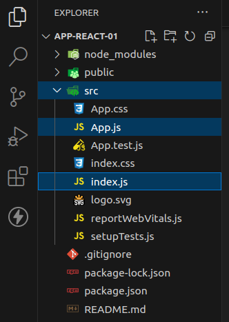
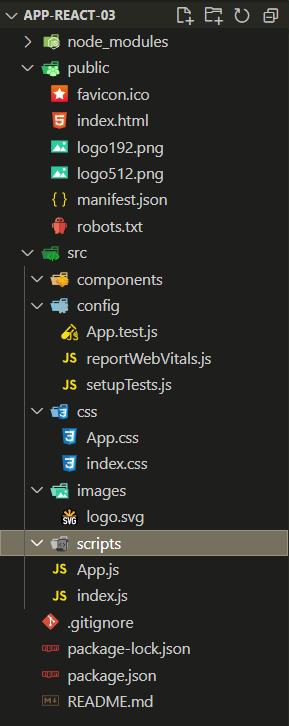

<base target="_blank">

# Configuracion inicial de un proyecto react
https://youtu.be/Ykr2PcEkgtI?list=PLTiQ_YHUSSeDX7yusyZTG65HcC0NU1W3h&t=146
### Necesitamos: 
1. [node y npm](https://nodejs.org/es)
2. [babel](https://babeljs.io/) _(no obligatorio)_

Hola mundo REACT
creación de proyecto
estructura base del proyecto
renderizado - manejo
comandos mpx / npm

# Iniciar un [nuevo proyecto](https://youtu.be/Ykr2PcEkgtI?list=PLTiQ_YHUSSeDX7yusyZTG65HcC0NU1W3h&t=902) de React

Documentacion oficial: 
<https://es.react.dev/learn/start-a-new-react-project>


1. Creacion del proyecto para trabajar con **node**
```PowerShell 
   npx create-react-app <nombre proyecto>
```

Es posible que drante el proceso se pida que instales algun paquete adicional a react, investiga que es el paquete y para que lo utiliza.

### Que es npx en react?
En `React` y en el ecosistema de desarrollo de `Node.js` en general, `npx` es una herramienta que se utiliza para ejecutar paquetes o comandos de `Node.js` directamente desde el registro de paquetes `npm` *(Node Package Manager)* sin necesidad de instalarlos globalmente en tu sistema. 
`npx` se incluye con npm a partir de la versión *5.2.0* y es útil para ejecutar comandos temporales, paquetes únicos o scripts que no necesitas instalar de forma global.

Por ejemplo, cuando estás trabajando con una aplicación `React`, es común utilizar `npx` para ejecutar comandos relacionados con `React`, como la creación de una nueva aplicación o la ejecución de un servidor de desarrollo. 
Algunos ejemplos comunes de uso de `npx` en el contexto de `React` incluyen:

1. Crear una nueva aplicación `React`:

```bash
    npx create-react-app my-app 
```
Este comando utiliza `npx` para ejecutar el paquete *create-react-app* sin necesidad de instalarlo previamente. 
Crea una nueva aplicación `React` llamada `"my-app"`.

2. Ejecutar el servidor de desarrollo:

```bash
    cd my-app
    npx react-scripts start
```
Este comando inicia el servidor de desarrollo para tu aplicación `React`. 
Nuevamente, `npx` se utiliza para ejecutar el paquete `react-scripts` sin necesidad de instalarlo globalmente.

**En resumen**, `npx` es una forma conveniente de ejecutar comandos de paquetes de `Node.js` sin tener que preocuparte por la instalación global de estos paquetes. 

Facilita la gestión de dependencias y te permite ejecutar scripts y comandos de forma eficiente en proyectos de `React` y otros proyectos de `Node.js`.

Tambien es posible que encuentre algunas vulnerabilidades, dependiendo de la gravedad, puedes o no ejecutar el comando que se sugiere.

Asi como estas [_vulnerabilidades_](https://youtu.be/Ykr2PcEkgtI?list=PLTiQ_YHUSSeDX7yusyZTG65HcC0NU1W3h&t=1458) que se presentan, puede haber algun otro error en el proceso de instalacion.

Tengamos en cuenta que *esto es un lenguaje compilado* y *es totalmente normal y habitual que se nos presenten estas situacion de errores o fallas*, en caso que suceda, debemos tener presente que, nosotros estamos trabajando en un area en que debemos *aprender a resolver problemas*, por lo que debemos comprender el *error* que se nos presenta para saber como resolverlo.

* Muchas veces esto se resuleve con reiniciar el editor (VSC)

Tambien debemos tener presente que siempre nos cruzaremos con algun problema en el codigo o en algun proceso de instalacion si somos, *trainee*, *junior*, *SSr* o *Sr*, una de las diferencias entre esto es, la `experiencia` y `dedicacion` a comprender, no solo el lenguaje `javaScript` sino que los problemas que se presentan en todo este proceso de aprendizaje y ejecucion.

```PowerShell 
   npm audit fix --force
```

O puedes tambien correr el siguiente comando para ver un detalle del proceso `audit`

```PowerShell 
   npm audit
```
Algunos errores comunes son de Las vulnerabilidades, pueden venir por el lado de postCSS y aca es cuando debemos seguir desarrollando nuestra autonomia y encontrar el porque de este problema y como resolverlo _(si es un problema que no te permite avanzar, por supuesto)_.

### [Que es postCSS?](https://desarrolloweb.com/home/postcss) 

Luego tendremos las instrucciones y comandos para gestionar el proyecto, *recuerda que debes estar dentro del directorio* para ejecutar cualquier comando.

Una vez que este todo cargado y corregido inicializamos el servidor con 

```PowerShell 
   npm start
```

Una vez que nuestro localhost esta levantando el ejemplo de React veremos este mensaje por consola

```PowerShell
You can now view app-react-03 in the browser.

  Local:            http://localhost:3000
  On Your Network:  http://192.168.0.2:3000

Note that the development build is not optimized.
To create a production build, use npm run build.
Compiled successfully!
```

Nosotros vamos a trabajar con `./src/App.js` y con `./src/index.js`



Acomodamos el proyecto para que nos sea de mas comididad gestionar y administrarlo



# [Recorriendo la arquitectura de react direcorio public](https://youtu.be/Ykr2PcEkgtI?list=PLTiQ_YHUSSeDX7yusyZTG65HcC0NU1W3h&t=2697)
Hacemos un recorrdio de cada uno de los directorios que nos agrego a nuestro proyecto.

# [Instalacion de bootstrap en react js](https://youtu.be/Ykr2PcEkgtI?list=PLTiQ_YHUSSeDX7yusyZTG65HcC0NU1W3h&t=2909)

1) [Bootstrap framework](https://getbootstrap.com/docs/5.3/getting-started/introduction/)

2) [Bootstrap icons](https://icons.getbootstrap.com/)

Dentro del body en `public/index.html` se estara renderizando todo lo que se crea en react, por lo que nosotros no necesitaremos en esta instancia modificar nada de lo que aqui encontremos, solo modificaremos si es que necesitamos instalar algun complemento como en este ejemplo hicimos instalando react y algunos archivos propios del proyecto

```html
<body>
   <div id="root"></div>
</body>
```

# [Recorriendo la arquitectura de react directorio src _(source)_](https://youtu.be/Ykr2PcEkgtI?list=PLTiQ_YHUSSeDX7yusyZTG65HcC0NU1W3h&t=3115)

Dentro de index.js encontraremos toda la logica y cada uno de los componentes que va a renderizar dentro de React.StrictMode

```js
import React from 'react';
import ReactDOM from 'react-dom/client';
import './css/index.css';
import App from './components/App.js';
import reportWebVitals from './config/reportWebVitals';

const root = ReactDOM.createRoot(document.getElementById('root'));

root.render(
  <React.StrictMode>
    <App /> //Component
  </React.StrictMode>
);

reportWebVitals();
```
Cada uno de los import que nos sirven para hacer funcionar nuestro proyecto [explicado](https://youtu.be/Ykr2PcEkgtI?list=PLTiQ_YHUSSeDX7yusyZTG65HcC0NU1W3h&t=3415) 


